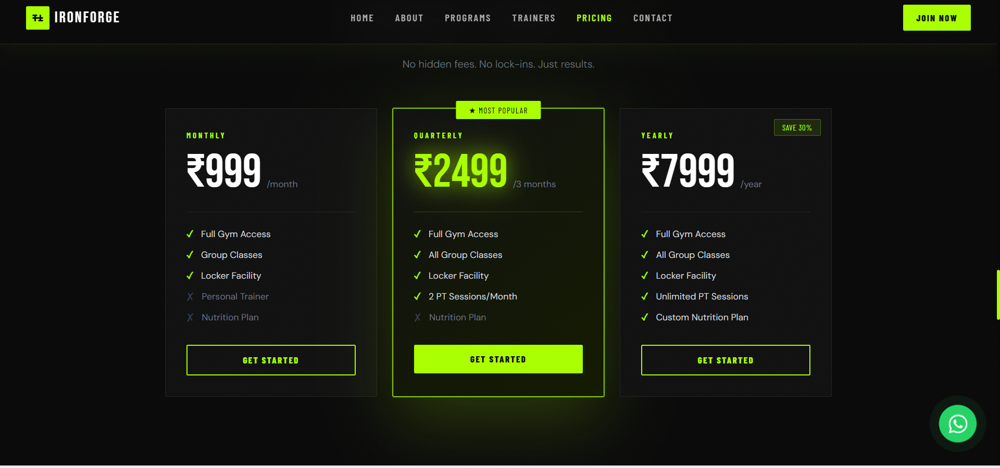

# 🏋️ Gym Website

A modern and responsive **Gym Website** built using HTML, CSS, and JavaScript.
This project showcases a clean UI design for fitness businesses with sections like services, pricing, and contact.

---

## 🚀 Live Demo

👉 https://manjupriya-j.github.io/GymWebsite/

---


## 📸 Screenshots


### 🏠 Home Page


### 💪 Services



## 📌 Features

* 🧑‍💻 Responsive design (mobile + desktop)
* 🎨 Modern UI with clean layout
* 📋 Sections for services, plans, and contact
* ⚡ Fast and lightweight website
* 💡 Beginner-friendly structure

---

## 🛠️ Tech Stack

* HTML5
* CSS3
* JavaScript

---

## 📂 Project Structure

```
GymWebsite/
│── index.html
│── style.css
│── script.js
│── images/
```

---


## 🎯 Purpose

This project is created as part of my learning journey in **frontend development** and to build a strong portfolio.

---

## 🙋‍♀️ Author

**Manju Priya**

* GitHub: https://github.com/Manjupriya-J

---

## ⭐ Future Improvements

* Add backend for user login/signup
* Integrate payment system for memberships
* Add animations and advanced UI

---

## 📢 Note

Feel free to fork and improve this project!


